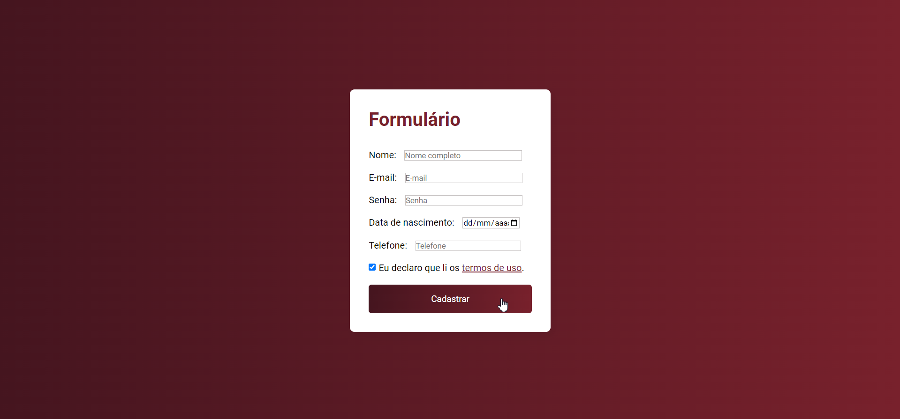

    

## 💻 Projeto
Esse é um projeto Web de um formulário que armazena os cadastros feitos em um campo no final da seção.

## 🚀 Tecnologias
Esse projeto foi desenvolvido utilizando:
- HTML
- CSS
- JavaScript básico
